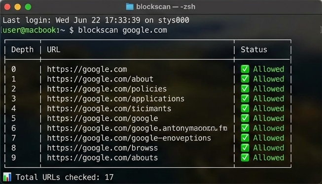

<p align="center">
  
</p>

<h1 align="center">BlockScan 🕵️‍♂️</h1>

<p align="center">
  <strong>A lightning-fast, concurrent CLI tool to detect bot-blocking and map crawlable domains.</strong>
</p>

<p align="center">
  <a href="https://rustup.rs/"></a>
  <a href="https://tokio.rs/"></a>
  <a href="https://clig.dev/"></a>
</p>

---

## 🚀 Overview

`blockscan` is a robust Command Line Interface (CLI) application built in Rust. Whether you're a security researcher, SEO specialist, or developer, `blockscan` helps you rapidly determine if a target website blocks automated bot crawling (e.g., via Cloudflare, 403 Forbidden, or Rate Limiting).

If the website permits crawling, it seamlessly discovers and recursively lists other crawlable links within the same domain, presenting them in a beautiful, terminal-friendly table format.

<p align="center">
  
</p>

---

## ✨ Key Features

- **🛡️ Bot Blocking Detection:** Analyzes HTTP responses for 403s, 429s, and CAPTCHA challenges to definitively identify bot mitigations.
- **🔗 Smart In-Domain Discovery:** Extracts hyperlinks and intelligently normalizes domains (e.g., merging `www` and root domains) to ensure deep, accurate crawling.
- **⚡ High-Speed Concurrency:** Leverages `tokio` and `reqwest` to perform asynchronous, parallel requests, bounded by a customizable semaphore limit to respect servers.
- **📊 Gorgeous Terminal UI:** Outputs results in a sleek CLI table powered by `comfy-table`, complete with a live progress spinner.
- **🤖 Machine-Readable Mode:** Supports `--json` and `--plain` flags for easy integration into bash scripts and automated data pipelines.

---

## 📦 Installation

Ensure you have [Rust and Cargo installed](https://rustup.rs/).

1. **Clone the repository:**
   ```bash
   git clone https://github.com/akbhoi/blockscan.git
   cd blockscan
   ```

2. **Build the release binary:**
   ```bash
   cargo build --release
   ```

3. **Run the executable:**
   ```bash
   ./target/release/blockscan --help
   ```

*(Optional: Move the binary to a directory in your `$PATH` like `/usr/local/bin` for global access)*

---

## 🛠️ Usage

Simply provide the target URL. `blockscan` will auto-prepend `https://` if omitted.

### Basic Scan
```bash
blockscan google.com
```

### Advanced Scan
Customize the crawl depth, concurrency limit, and spoof the User-Agent:
```bash
blockscan --depth 3 --concurrency 50 --user-agent "MyCustomBot/1.0" https://example.com
```

### Scripting & Pipelines
Disable formatting or output as JSON to pipe the results into `jq` or `grep`:
```bash
blockscan example.com --json | jq '.'
blockscan example.com --plain | grep "Allowed"
```

---

## ⚙️ Options Reference

| Flag / Option | Description | Default |
|---|---|---|
| `<URL>` | The target URL to scan (Required). | - |
| `-d, --depth <DEPTH>` | Maximum crawl depth (`0` for unlimited). | `2` |
| `-c, --concurrency <C>` | Maximum concurrent requests limit. | `10` |
| `-u, --user-agent <UA>` | Custom User-Agent string for requests. | `blockscan/1.0.0 (Bot)` |
| `-j, --json` | Output results in JSON format. | `false` |
| `--plain` | Output results in raw plain text format (no UI). | `false` |
| `--no-color` | Disable colored terminal output. | `false` |
| `-h, --help` | Print help information. | - |
| `-V, --version` | Print version information. | - |

---

<p align="center">
  <i>Built with ❤️ in Rust</i>
</p>
